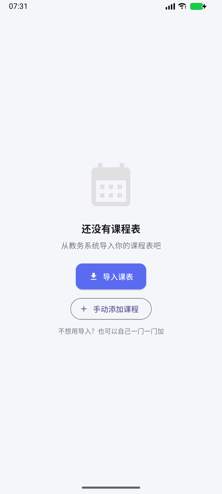

# 内江师范学院课程表

一个美观的**安卓课程表应用**，支持**内江师范学院教务系统课程表导入**，基于 Flutter 开发，
并针对 **vivo / iQOO（OriginOS）** 做了专门优化 —— 课程提醒可投递到 **原子通知 / 原子岛**。

> 📱 **本项目只做安卓版**（Windows 桌面工程已移除）。所有提醒能力基于 Android 的
> `AlarmManager` + `Notification` 实现，在手机上真正可用。

## 📦 下载安装

最新版 **v1.2.0** 已发布到 GitHub Releases：

**<https://github.com/Sirin-NJTC/njtc_schedule/releases/latest>**

| 文件 | 体积 | versionCode | 适用 |
| --- | --- | --- | --- |
| `njtc-schedule-1.2.0-arm64-v8a.apk` | 43.46 MB | 2017 | **首选**，近几年绝大多数手机 |
| `njtc-schedule-1.2.0-armeabi-v7a.apk` | 39.31 MB | 1017 | 2016 年前后的老机器 |
| `njtc-schedule-1.2.0-x86_64.apk` | 45.31 MB | 4017 | 模拟器（Android Emulator / 安卓子系统） |
| `njtc-schedule-1.2.0-universal.apk` | 92.81 MB | 17 | 不确定机型时用，四个架构都含 |

> 📈 **v1.2.0 起安装包大了一圈**（arm64 从 19.45 MB 涨到 43.46 MB）：离线 OCR 的
> 中文语言模型 `chi_sim.traineddata` 12.5 MB + `eng.traineddata` 3.9 MB 随包提供
> （**必须不压缩存放**，否则原生引擎读不了），再加上 `libtesseract.so` / `libleptonica.so`
> 约 6.7 MB。换来的是**拍照识别课表完全离线**，不联网、不上传。

> ⚠️ 这几个包用 Flutter 模板默认的 **debug 签名**，装到自己手机上用没问题，但**不能上架应用商店**
> （换成自己的 keystore 的步骤见 `BUILD_NOTES.md`）。
>
> ⚠️ **v1.1.13 的 Release 里混进了一个 85 MB 的 `app-arm64-v8a-debug.apk`**（传包时把
> `build/app/outputs/flutter-apk/` 下的 debug 产物也一起带上了；CI 的 release.yml 只传
> `*-release.apk`）。请以 **v1.2.0** 的四个包为准，v1.1.13 的页面仅作历史留存。

推 `v*` 标签会自动出包：`.github/workflows/release.yml` 会跑 `flutter analyze` → `flutter test`
→ 构建四个 ABI → 传成 Release 资产。若要在本地重建并上传，用 `D:\DSH\github_release.ps1`
（需 `GH_PAT` 环境变量，令牌对本仓库要有 `Contents: Read and write`）。

## ✨ 功能特性

- 📥 **课程表导入**（四种方式）
  - **网页登录导入**（推荐）：应用内直接打开教务系统网页，**像浏览器一样登录**
    （学校教务**无需 VPN**），登录后点「读取课表」即可抓取当前课表页并自动解析。
    抓取有**两条路**：优先直接请求教务的数据接口（正方 jwglxt 的
    `xskbcx_cxXskbcxIndex.html?doType=query&gnmkdm=N2151`，拿到的是**整学期**
    原始数据，比抠页面稳），接口不可用时自动回落到解析渲染后的表格
    （学校把教务挂在**反向代理域名**下时，会自动从 URL 里反推出真实接口地址再请求）
  - **文件导入**：支持教务系统导出的 **老式 `.xls`**、`.xlsx`，以及 **`.docx` / `.doc` /
    `.pdf` / 网页（`.html`）/ 纯文本** 课程表；自动识别课程名、教师、地点、周次、节次、
    单双周、课程代码、教学班。`.docx`、`.doc`、`.html`、`.txt` 都是**纯 Dart 本地解析**
    （自带的 zip / OLE2 / RTF / HTML 读取器），不依赖任何在线服务
  - **拍照 / 相册 OCR**：把课表截图或纸质课表**拍下来**直接识别成课表 ——
    识别用的是 **Tesseract（中文 + 英文模型）**，**全程在本机离线完成，不联网、不上传**
    （语言模型随安装包提供，首次使用会从安装包复制到应用目录）
  - **粘贴文本**：把课表单元格内容复制粘贴进来即可解析
- 🔍 **课表全览**：首页右上角「全览」把**本周放大成一整页**，左右箭头翻周、
  双指缩放看细节；只翻全览页自己的周次，**不会带动首页**（点「回到本周」即可复位）
- ✏️ **手动增删改**：导入缺了教师或教室时，可以自己补 —— 首页右上角「＋」新增，
  点课程格子进详情后可**编辑 / 删除**；保存后课程提醒会**自动重排**
- ⏰ **课程提醒**（无需联网、无需服务器）
  - **提前 30 分钟 = 时段预告**：只在该时段（上午 / 下午 / 晚上）**第一节课**前触发，
    通知里**逐条列出该时段全部课程**，方便一次带齐所有教材
  - **提前 15 分钟 = 时段首课提醒**：同样只对时段第一节课触发
  - **提前 5 分钟**：**每一节课**都提醒
  - **下课前 5 分钟预告**：只对**不连堂**的课触发，提示下一节课的课名与地点
  - 提醒计划由 App 在本地排布：**14 天滚动窗口 + 每日自巡检闹钟**，
    长期不打开 App 也不会漏提醒；**重启手机后自动恢复**
  - 权限自检卡片：通知权限 / 精确闹钟 / 电池优化，逐项检测并一键跳转系统设置
- 🟣 **vivo / iQOO 特殊优化**
  - 「下节课预告」可投递为 **原子通知**，在**状态栏胶囊**与 **原子岛**上显示
  - 自动识别设备是否为 vivo/iQOO、是否为 OriginOS 5.0+（支持原子岛），
    依次尝试 5 个系统组件跳转 **自启动管理 / 后台白名单** 页面
  - **未开通 vivo 原子通知准入时自动降级为普通通知**（官方 `showNotify` 默认行为），
    提醒绝不会丢 —— 纯增益功能，可放心默认开启
  - 完整接入说明与申请邮件模板见 [`VIVO_ATOMIC_NOTIFICATION.md`](VIVO_ATOMIC_NOTIFICATION.md)
- 🎨 **美观界面**：柔和渐变配色、卡片式课程块、Material 3 设计
- 👀 **显示开关**（设置 → 课表显示）
  - **显示周六 / 周日**：关掉后课表只画周一到周五五列，屏幕窄的时候更好看
  - **显示非本周课程**：打开后，本周不上（周次或单双周不匹配）的课也会**半透明**画出来，
    一眼能看到整学期的分布；点进去照样能看课程详情
- 📅 **周次切换**：一键切换教学周，自动只显示该周实际要上的课；
  点中间的「第 N 周」可直接**选周**（四列网格，本周有标记、非本周显示对应日期），
  翻到别的周后会出现「**回到本周**」按钮；同格的冲突课**并排显示**，不再互相覆盖
- 🎌 **法定节假日 / 调休**（设置 → 法定节假日）
  - **放假当天不提醒**开关：放假日整天不排课程提醒（连「下节课预告」也不会漏出去）
  - **联网更新**：一键拉取公开的放假 / 调休安排（按年份整年替换，没公布的年份保持不动）；
    启动时若超过 30 天没更新过会自动静默同步一次，失败就保持原日历并说明原因；
    **手动改过的日历不会被自动覆盖**（想强制更新就点页面上的按钮，会有二次确认）
  - 内置一份放假日历（2026 中秋 / 国庆、2027 元旦，**估算值**），可以**自己增删改**；
    调休补班日也由你自己加 —— 格式是「这一天**按周几**上课」，补班日照样提醒
    （联网拿到的补班日，「按周几上课」按惯例推导，界面会提示核对）
  - 改完日历会**立刻重排**闹钟，不用重装也不用重启
- ⏰ **课堂倒计时**：显示距离下一节课的剩余时间
- 📚 **多课表管理**：可保存多份课表，随时切换、重命名、删除
- 🔄 **单双周支持**：自动识别单周 / 双周 / 每周课程
- 🕘 **作息时间可自定义**：内置 11 节次作息表（按学校《关于执行全年统一作息时间的通知》，
  **2026-05-06 起**：上午 08:20 起、下午 14:20 起、晚上 19:00 起，每节 45 分钟），
  课程块显示起止时间；
  在「设置 → 节次时间」里可以逐节改上下课时间（也可以一键恢复学校默认），
  改完课表、倒计时与课程提醒会一起按新时间走
  （老版本 App 升级上来会自动换到新作息，你自己调过的时间不会被覆盖）
- 🧩 **桌面小组件「今日课程」**：把今天要上的课直接摆在桌面上（时间 + 课名 + 地点 + 配色条），
  跨零点 / 改课表 / 重启手机都会自动刷新；在「设置 → 桌面小组件」里有启用说明与「立即同步」
- 📱 **本地存储**：数据仅保存在本地设备，不上传任何服务器

## 🖼️ 界面预览

### 真机效果（Android 模拟器实测截图）

| 课表主界面（导入真实课表后） | 空状态（首次启动） |
| --- | --- |
|  |  |

> 两张截图都是**在本项目真实运行的 App 上**截取的（Android 模拟器 API 37），
> 不是效果图。左侧截图为导入真实教务系统 `智26.8课表.xls` 后的渲染结果。

### v1.2.0 新增功能（真机实测截图）

| 课表全览（本周放大成一整页） | 导入页（文件 / OCR 入口） | 识别结果确认（真机 OCR 置信度 83%） |
| --- | --- | --- |
|  |  |  |

> 三张都是在 **vivo 真机（Android 17 / arm64）** 上、装着作者本人真实课表的状态下截的：
> 全览页里周二 / 今天两列正好是**国庆假期**（列头写「放假」、格子里的课被淡化）；
> 第三张是「拍照 / 相册 OCR」跑完后的确认框 —— 识别**在本机离线完成**，
> 文字可以直接改，确认无误才会解析导入（截图里故意点了「取消」，没有动真实课表）。

### 免安装网页预览

仓库根目录的 **`preview.html`** 是用真实课表数据 + 与本项目完全一致的解析 / 颜色 /
周次逻辑做的一份可视化预览，**双击即可用浏览器打开**，方便在没装 Flutter 的机器上
直观查看界面效果。

## 🚀 快速开始

### 环境要求

| 项目 | 要求 |
| --- | --- |
| **Flutter SDK** | **≥ 3.27**（本项目用 **3.47.6 stable** 实测） |
| **Android SDK** | compileSdk / targetSdk **36**、build-tools 36.0.0、minSdk 24 |
| **JDK** | **17 ~ 21**（⚠️ 不要用 22 及以上，见 BUILD_NOTES 第 3.2 节） |
| 设备 | Android 7.0+ 手机；vivo/iQOO 手机可获得原子岛体验 |

```bash
flutter doctor -v
```

### 运行

```bash
cd njtc_schedule
flutter pub get
flutter devices
flutter run -d <device-id>
```

> `android/` 平台工程已随仓库提供，通常**无需**再执行 `flutter create`。
> 若你的 Flutter 版本较新想重新生成：
> `flutter create --platforms=android --org cn.edu.njtc .`
> （该命令会额外生成无用的 `test/widget_test.dart`，请删除后再跑 `flutter test`。）

> 🔧 **首次构建前建议先读 [BUILD_NOTES.md](BUILD_NOTES.md) 第 3 节《常见构建故障》**，
> 其中记录了真实踩过的坑（symlink / 跨盘符 Kotlin 增量缓存 / JDK 版本 /
> `file_picker` 版本要求）及逐条解法。

### 测试

```bash
flutter analyze   # 应当输出 No issues found!
flutter test      # 272 个用例全部通过
```

`test/widget_layout_whitelist_test.dart` 会扫描 `android/app/src/main/res/layout/widget_*.xml`，
只允许 `RemoteViews` 白名单里的控件（`android.view.View` 之类会直接让宿主 inflate 失败、
桌面小组件变成一张白卡 —— 1.1.6~1.1.8 的白卡就是这么来的），所以这个测试**必须**在项目根用
`flutter test` 跑（它读的是相对路径）。

课程提醒与网页导入都需要真实设备上的端到端验证（会真的排闹钟、真的发通知、
真的开 WebView）：

```bash
# 提醒链路：排闹钟 → 发通知 / 原子通知字段
flutter test integration_test/reminder_e2e_test.dart -d <device-id>

# 节假日 / 调休补班日真的会改闹钟（放假不排、补班换个周几排）
#   注意：跑完 App 会被卸载，请用模拟器，别拿装了真实课表的真机跑
flutter test integration_test/holiday_reminder_e2e_test.dart -d emulator-5554

# 网页导入（渲染后的 DOM 路径）：先起一个固件 HTTP 服务
python -m http.server 8137 --bind 0.0.0.0 --directory test/fixtures
flutter test integration_test/web_import_e2e_test.dart -d <device-id>

# 网页导入（正方 jwglxt 数据接口路径）：用能应答 POST 的固件服务
python tool/jwglxt_fixture_server.py 8138
flutter test integration_test/jwglxt_json_e2e_test.dart -d <device-id>

# 本地离线 OCR（图片 / PDF）：先把 PDF 夹具推进设备（图片那条自己画图，不用夹具）
adb push test/fixtures/ocr_sample.pdf /storage/emulated/0/Android/data/cn.edu.njtc.njtc_schedule/files/
flutter test integration_test/ocr_e2e_test.dart -d emulator-5554

# 网页导入（反向代理形态 = 内江师范真实地址）：
#   真机上固件服务在宿主机，要先反投端口，再覆盖固件地址
adb reverse tcp:8138 tcp:8138
flutter test integration_test/jwglxt_proxy_e2e_test.dart -d <device-id> \
  --dart-define=FIXTURE_HOST=http://127.0.0.1:8138
```

第三个固件服务同时扮演**反向代理**：`/sso/driotlogin?url=…`（原地吐课表页，
真地址在 `url=` 里、双层百分号编码）和 `/sso/driotlogin_r`（302 跳到课表页），
两条路都必须推出同一个数据接口 `/kbcx/xskbcx_cxXsKb.html`；
`/__posts` 还能把服务端收到的 POST 路径读回来，证明打的是数据接口而不是页面地址。

跑完后可用 `adb shell dumpsys alarm` 与
`adb shell dumpsys notification --noredact` 复核原生侧状态，
详见 [`BUILD_NOTES.md`](BUILD_NOTES.md) 第 9.1 节。

### 打包

```bash
# 通用 APK（产物 build/app/outputs/flutter-apk/app-release.apk）
flutter build apk --release

# 按 ABI 拆分（体积更小）
flutter build apk --release --split-per-abi

# 上架用 AAB
flutter build appbundle --release
```

更完整的构建 / 签名说明见 [`BUILD_NOTES.md`](BUILD_NOTES.md)。

## 📖 使用指南

### 导入课程表（推荐：网页登录导入）

1. 打开本应用 → 底部「导入」→ 点**「登录教务系统网页导入」**
2. 在应用内打开的网页里登录：默认落在**智慧内师「融合门户」**
   （`tpass.njtc.edu.cn`，公网可达），**像浏览器一样输入学号密码**即可；
   学校教务**无需 VPN**。登录态由 WebView 自己保存，下次导入通常不用重新登录
3. **自己在门户里点进「课表查询 / 我的课表」**（如果门户里点不动，右上角 ⋮ 菜单有
   「打开课表查询页」可以走教务深链），看到课表后页面右上角按钮变绿显示「读取课表 ✓」
4. 点**「读取课表」**，App 会抓取当前课表页并自动解析成课表

> **为什么默认入口是公网主机上的门户**：校内那个 `pass.njtc.edu.cn`
> **只在校园网 DNS 里有记录**，校外打开会 `net::ERR_NAME_NOT_RESOLVED`（真机实测）。
> 同一个门户在 `tpass.njtc.edu.cn` 上也能开：它先 302 到统一身份认证，登录后就是门户首页。
> 默认入口取 `https://tpass.njtc.edu.cn/app.php/portal_v4`，校外也能用。
>
> 之所以是「先到融合门户、再由用户自己点进课表」：一步到位的 CAS 深链依赖
> 学校 `proxy.njtc.edu.cn/zytec_proxy/cas_login` 那一跳，而它可能服务端报错
> （真机日志里出现过 `Webservice currently unavailable`）。走门户登录更稳，
> 用户也能看到自己确实进了哪个系统。
>
> 抓取逻辑**借了成熟课表 App 的实现思路**（见 `BUILD_NOTES.md` §9.9）：
> 正方系的课表容器 id 是 `#Table1` / `#table1` / `#kbgrid_table` / `#sycjlrtabGrid`
> （`#kbtable` / `.kbcontent` 其实是**强智**的，只作兜底），并会依次尝试
> 页面内联全局变量（`veInitDefaultJson` / `__INITIAL_STATE__` / `kbxx` / `kckbData` …）、
> 整页 JSON、同源 iframe（课表经常嵌在 iframe 里），命中不了才回落 DOM 打分。
> 字段靠 `title="教师 / 周次(节次) / 地点 / 教学班"` 标注，解析器
> `lib/services/zf_html_parser.dart` 对三种形态逐级兜底：
> ①正方课表结构 → ②页面里任意 HTML 表格（交给 `TimetableParser.parseGrid`）
> → ③页面纯文本（交给 `TimetableParser.parseFreeText`）。
> 学校把教务挂在**反向代理域名**下时，会根据当前 URL 反推出真实接口地址再请求
> （否则拿不到教师与教室字段）。万一带回来的是登录页 / 错误页，App 会明确提示，
> 并可**一键把抓到的文本转成粘贴导入**。
> 抓不到时还会在 logcat 打一行 `NjtcWebImport: page diag={…}`（标题 / 表格数 /
> 下拉框 / 全局变量），用来判断「当前这个页面到底是什么」。

### 导入课程表（备选一：文件导入）

1. 登录内江师范学院教务系统（智慧内师 → 教务系统）
2. 进入「课程表」页面，导出 / 下载课程表文件
3. 打开本应用 → 底部「导入」→「导入教务系统导出的文件」
4. 选择文件，应用会自动解析并展示

> 导入时会自动从文件页脚解析「本学期 2026-08-31 正式上课 …… 共 20 周」，
> 因此**学期起始日期与总周数会被自动填好**，无需手动设置。

> **注意**：教务系统导出的是**老式 `.xls`（OLE2 / BIFF8）**，而不是 `.xlsx`。
> Dart 生态的 `excel` 包只支持 `.xlsx`，所以本项目**自带**了一个纯 Dart 的
> `.xls` 读取器 `lib/services/xls_reader.dart`，导入时会按文件头自动分流：
>
> - `D0 CF 11 E0 A1 B1 1A E1`（OLE2）→ 自带 `XlsReader`
> - `50 4B 03 04`（zip）→ `excel` 包按 `.xlsx` 解析
>
> 两条路径最终都交给 `TimetableParser.parseGrid` 变成课程。若遇到极端格式，
> 可在 Excel / WPS 中「另存为 `.xlsx`」后重试，或改用「粘贴课程表文本」。

除表格文件外，导入页的**「导入课表文件」**还认这几种（都从**文件头**判断，不看后缀）：

| 文件 | 怎么读的 |
| --- | --- |
| `.docx` | 纯 Dart 解 zip → 读 `word/document.xml` → 表格按行列取回（`docx_reader.dart`） |
| `.doc`（老版 Word） | 纯 Dart 扫 OLE2 容器里的 UTF-16 文本流（`doc_reader.dart`）；捞不出字会明确提示换格式 |
| `.pdf` | 交给系统 `PdfRenderer` 逐页渲染成位图，再走本机 OCR（不需要联网） |
| `.html` / `.htm` | 纯 Dart 去标签、把表格的 `</td>` 当列分隔、还原实体（教务网页「另存为」也能导入） |
| `.rtf` | 纯 Dart 解析 RTF（含 `\uNNNN` 与 `\'hh` GBK 转义） |
| `.txt` / 其它 | 按 UTF-8 / UTF-16 / GBK 依次嗅探编码后当文本解析 |

### 导入课程表（备选二：拍照 / 相册 OCR）

1. 导入页 → **「拍照 / 相册 OCR 识别」**（第一次用会从安装包把语言模型复制到应用目录，稍等几秒）
2. 对着课表**拍一张**，或从相册选一张课表截图（建议拍正、光线均匀、字别太小）
3. 识别完会弹一个**可编辑的文本框**：先看一眼有没有错字，改完再点「解析导入」
   （置信度低于 60% 时会提示「请核对识别结果」）

> OCR 用的是 **Tesseract `chi_sim+eng`**，通过 `tesseract4android` 在本机跑，
> **不联网、不上传任何图片**；语言模型（约 16 MB）随安装包提供，
> 仓库里不提交模型文件（`android/app/src/main/assets/tessdata/` 在 `.gitignore` 里），
> 自己从源码构建前请先跑 `tool/fetch_tessdata.ps1` 或看 CI 里那一步。

### 设置当前周

- 导入后若页脚缺失（例如粘贴导入），在「设置」页手动设置**学期起始日期**，
  应用会自动推算当前第几周；首页也会在未设置时给出橙色提示条
- 也可以直接在首页用左右箭头切换周次

### 开启课程提醒

1. 首页右上角**铃铛图标**（或「设置 → 课程提醒」）进入提醒页
2. 打开「开启课程提醒」，勾选需要的提前时间（30 / 15 / 5 分钟）与「下节课预告」
3. 按「权限检查」卡片逐项授权（通知 / 精确闹钟 / 电池优化）
4. 点「立即验证」里的三个按钮 —— **上课提醒** / **时段预告** / **下节课预告** —— 分别看效果

**提醒时机规则**（内置作息：上午 1-4 节 / 下午 5-8 节 / 晚上 9-11 节）：

| 时机 | 触发范围 | 通知内容 |
| --- | --- | --- |
| 提前 30 分钟 | **仅时段第一节课** | **该时段全部课程预告**（逐条列出时间 / 课名 / 地点），提示带齐教材 |
| 提前 15 分钟 | **仅时段第一节课** | 该节课的上课提醒 |
| 提前 5 分钟 | **每一节课** | 该节课的上课提醒 |
| 下课前 5 分钟 | **仅不连堂的课** | 下一节课预告（课名 + 地点） |

> **连堂** = 紧接着的下一节课**同名、同地点、节次连号**（例如第 1-2 节是同一门课连上），
> 这种课不会发下节课预告。

> vivo / iQOO 用户会额外看到「原子通知 / 原子岛」开关与「自启动 / 后台运行」入口。
> 原子通知需要向 vivo 申请准入后才真正生效，**未开通时自动降级为普通通知**。
> 申请流程、邮件模板与字段对照见 [`VIVO_ATOMIC_NOTIFICATION.md`](VIVO_ATOMIC_NOTIFICATION.md)。

### 把「今日课程」放到桌面

1. 先在 App 里导好课表（小组件读的就是 App 里当前生效的那份课表）
2. 设置页 → **「桌面小组件」** → 按里面的三步说明操作，或直接点「立即同步」把数据推一次
3. 长按桌面空白处 → **桌面挂件 / 小组件** → 找到「**今日课程**」拖到桌面即可

小组件会显示今天的日期与第几周，然后逐条列出「时间 · 课名 · 地点」，左边一条颜色与 App 里
课程块的颜色一致；今天没课就显示「今天没课，好好休息」，超过 5 门会折成「还有 N 门 · 点开看全部」。
点一下小组件就打开 App。

> 刷新时机：改课表 / 改作息 / 换课表时 App 会主动推一次；此外跨零点、改系统时间或时区、
> 重启手机、App 更新后都会自动重画（系统最小刷新间隔 30 分钟，所以不依赖定时轮询）。

> 在「添加小组件」面板里看到的是一张**预览图**（`drawable-nodpi/widget_preview.png` +
> `layout/widget_today_preview.xml`）。预览与本体一样，**只能用 `RemoteViews` 白名单里的控件**：
> 写个裸 `<View>` 当颜色条，宿主 inflate 时会抛 `Class not allowed to be inflated`，
> 桌面上就只剩一张白卡（1.1.6~1.1.8 的白卡正是这么来的）。
> 现在有 `test/widget_layout_whitelist_test.dart` 把这条守住，改布局时请一并跑 `flutter test`。

## 🏗️ 项目结构

```
njtc_schedule/
├── lib/                                 # Dart 层
│   ├── main.dart                        # 应用入口（/reminders 等路由）
│   ├── app_state.dart                   # 全局状态（Provider，课表变更自动重排提醒）
│   ├── theme.dart                       # 主题配色（8 色课程色板，与原生侧一致）
│   ├── models/
│   │   ├── course.dart                  # 课程模型（含单双周判断）
│   │   ├── timetable.dart               # 课表模型（按天/周筛选）
│   │   ├── period.dart                  # 节次作息时间（11 节）
│   │   ├── display_prefs.dart           # 课表显示开关（周六日 / 非本周课程）
│   │   ├── holiday_calendar.dart        # 节假日 + 调休补班日（含内置放假日历）
│   │   └── reminder_prefs.dart          # 提醒偏好（时机 / 下课 / 原子通知 / 放假不提醒）
│   ├── services/
│   │   ├── timetable_parser.dart        # 课表解析器（核心，含页脚学期信息）
│   │   ├── xls_reader.dart              # 纯 Dart 的 .xls(BIFF8) 读取器
│   │   ├── reminder_service.dart        # MethodChannel 桥接原生提醒引擎
│   │   ├── widget_service.dart          # MethodChannel 把课表推给桌面小组件
│   │   ├── zf_html_parser.dart          # 正方解析（#kbtable/.kbcontent、jwglxt JSON 接口、多级兜底）
│   │   ├── holiday_sync_service.dart    # 节假日联网更新（解析 / 补班日推导 / 按年份合并）
│   │   ├── ocr_service.dart             # 本地离线 OCR 的 Dart 侧（图片 / PDF → 文字）
│   │   ├── document_parser.dart         # 文本 → 课表（编码嗅探 / 网格与自由文本两路）
│   │   ├── docx_reader.dart             # 纯 Dart 读 .docx（解 zip → word/document.xml）
│   │   ├── doc_reader.dart              # 纯 Dart 读 .doc（OLE2 里捞 UTF-16）/ RTF / HTML
│   │   └── jwxt_service.dart            # 网页登录导入（WebView → 抓取 → 解析链路）
│   ├── storage/
│   │   ├── timetable_store.dart         # 课表本地持久化
│   │   ├── period_store.dart            # 自定义节次时间的持久化
│   │   ├── display_store.dart           # 显示开关的持久化
│   │   ├── holiday_store.dart           # 节假日 / 补班日的持久化
│   │   └── reminder_store.dart          # 提醒偏好本地持久化
│   ├── pages/
│   │   ├── home_page.dart               # 首页（课表视图 + 周次选择器 + 倒计时 + 全览/提醒入口）
│   │   ├── week_overview_page.dart      # 课表全览（整周一页、双指缩放、左右翻周）
│   │   ├── import_page.dart             # 导入页（网页登录 / 文件 / 图片 OCR / 粘贴）
│   │   ├── course_edit_page.dart        # 手动添加 / 编辑 / 删除单门课程
│   │   ├── period_settings_page.dart    # 节次上下课时间自定义
│   │   ├── holiday_settings_page.dart   # 法定节假日 / 调休补班日
│   │   ├── timetables_page.dart         # 多课表管理
│   │   ├── reminder_settings_page.dart  # 课程提醒设置页
│   │   └── settings_page.dart           # 设置页
│   └── widgets/
│       ├── timetable_grid.dart          # 课表网格（冲突课并排、今天高亮）
│       ├── course_card.dart             # 课程卡片
│       └── course_detail.dart           # 课程详情弹窗
├── android/app/src/main/kotlin/cn/edu/njtc/njtc_schedule/
│   ├── MainActivity.kt                  # 注册通知通道 + 提醒桥
│   ├── webimport/WebImportActivity.kt   # 原生 WebView 导入（登录页 / 注入脚本 / 回传 payload）
│   └── reminder/                        # 原生提醒引擎（纯 Kotlin，无第三方依赖）
│       ├── Models.kt                    # 计划 / 课程 / 作息数据模型 + DayMath 日期换算
│       │                                #   （minSdk 24，故不用 java.time，全部走 Calendar）
│       ├── PlanStore.kt                 # 计划持久化（SharedPreferences）
│       ├── ReminderScheduler.kt         # 闹钟排布（setAlarmClock、14 天窗口 + 每日巡检）
│       ├── ReminderReceiver.kt          # 闹钟触发 → 发通知
│       ├── BootReceiver.kt              # 开机 / 更新后自动恢复
│       ├── NotificationFactory.kt       # 通知构造与配色
│       ├── VivoHelper.kt                # vivo 原子通知 / 原子岛字段与保活跳转
│       └── ReminderBridge.kt            # MethodChannel 方法表
│   └── widget/                          # 桌面小组件（今日课程）
│       ├── WidgetData.kt                # 从本机存档算出「今天要画哪几行」（周次/单双周/配色）
│       ├── NjtcWidgetStore.kt           # 小组件自己的持久化（timetable / periods / has_timetable）
│       ├── TodayWidgetProvider.kt       # AppWidgetProvider（静态 5 行 RemoteViews，不用列表）
│       └── WidgetBridge.kt              # MethodChannel：Dart 推数据 → 落盘 → 刷新
├── android/app/src/main/res/
│   ├── layout/widget_today.xml          # 小组件本体布局（只用 RemoteViews 白名单控件！）
│   ├── layout/widget_today_preview.xml  # 「添加小组件」面板里的预览布局（静态示例文字）
│   ├── xml/widget_today_info.xml        # AppWidgetProviderInfo（previewLayout / previewImage）
│   └── drawable-nodpi/widget_preview.png# 预览图（由 tool/make_widget_preview.py 生成）
├── test/
│   ├── timetable_parser_test.dart       # 解析器测试（内含真实课表全量回归）
│   ├── xls_reader_test.dart             # .xls 读取链路测试
│   ├── zf_html_parser_test.dart         # 正方 HTML / jwglxt JSON 解析测试
│   ├── web_import_test.dart             # 网页导入解析链路测试（四级兜底）
│   ├── timetable_grid_test.dart         # 网格渲染测试（冲突并排 / 高节次 / 单双周 / 连堂撑高 / 显示开关）
│   ├── home_page_test.dart              # 首页交互测试（周次选择器 / 回到本周）
│   ├── app_flow_test.dart               # 端到端：真实 .xls → 解析 → 网格渲染断言
│   ├── course_edit_test.dart            # 手动增删改课程
│   ├── period_settings_test.dart        # 节次时间自定义
│   ├── display_prefs_test.dart          # 显示开关：模型 / 持久化 / AppState
│   ├── holiday_calendar_test.dart       # 节假日日历：wire 格式 / 内置日历 / 存储 / AppState
│   ├── holiday_sync_test.dart           # 节假日联网更新：解析 / 补班日推导 / 合并 / 失败结局
│   ├── holiday_settings_test.dart       # 设置页与节假日页的交互（含联网更新按钮）
│   ├── week_overview_page_test.dart     # 课表全览页（翻周 / 不改首页当前周 / 网格放大参数）
│   ├── document_parser_test.dart        # 文本 → 课表（编码嗅探 / 网格 / 自由文本）
│   ├── docx_reader_test.dart            # .docx 解 zip 取表格（格内分隔用 `/` 不能用制表符）
│   ├── doc_reader_test.dart             # .doc（OLE2 捞 UTF-16）/ RTF / HTML 读取
│   ├── ocr_service_test.dart            # OCR 通道形状（mock MethodChannel，含不支持平台）
│   ├── widget_service_test.dart         # 桌面小组件推送（通道形状 / 异常吞掉 / 平台开关）
│   ├── widget_layout_whitelist_test.dart# 守住宿主 inflate：布局只能用 RemoteViews 白名单控件
│   ├── webimport_jsdom_payload_test.dart # 抓取脚本真 DOM 载荷 → 解析（整页 vs 载荷 逐门比对）
│   └── fixtures/
│       ├── njtc_sample.xls              # 真实教务系统导出样例（回归固件）
│       ├── zf_xskb_list.html            # 正方课表页固件
│       ├── ocr_sample.png               # OCR 夹具：课表两行字（tool/make_ocr_fixture.py 生成）
│       ├── ocr_sample.pdf               # OCR 夹具：同一张图存成 PDF（验 PdfRenderer 渲染）
│       └── extract_payload_jsdom.json   # 抓取脚本在真 DOM（jsdom）上跑出来的载荷
├── integration_test/
│   ├── reminder_e2e_test.dart           # 真机端到端：排闹钟 → 发通知 → superx 字段
│   ├── holiday_reminder_e2e_test.dart   # 真机端到端：放假日不排闹钟 / 补班日换周几排
│   ├── web_import_e2e_test.dart         # 真机端到端：WebView 抓 DOM → 解析成课表
│   ├── jwglxt_json_e2e_test.dart        # 真机端到端：WebView 打教务数据接口 → 解析成课表
│   ├── jwglxt_proxy_e2e_test.dart       # 真机端到端：反向代理形态（内江师范真实地址）
│   └── widget_render_e2e_test.dart      # 真机端到端：把小组件「会画成什么样」问出来（探针）
│   └── ocr_e2e_test.dart                # 真机端到端：tessdata 随包落地 + 图片/PDF 真识别
├── tool/
│   ├── jwglxt_fixture_server.py         # 正方数据接口 + 反向代理固件服务（仅测试用）
│   ├── make_ocr_fixture.py              # 生成 OCR 夹具（课表 PNG + 同图 PDF，Pillow）
│   └── make_widget_preview.py           # 生成小组件预览图（Pillow，纯离线）
├── screenshots/                         # 真机实测截图
├── android/                             # 平台工程（已生成）
├── preview.html                         # 免安装界面预览
├── VIVO_ATOMIC_NOTIFICATION.md          # vivo 原子通知接入说明 + 申请邮件模板
├── BUILD_NOTES.md                       # 详细构建说明
└── README.md
```

## ✅ 已验证内容

本项目已在 **Flutter 3.47.6 stable / Dart 3.13.5**（Windows 11 构建 / JDK 21 /
Android SDK 36）上实测：

- `flutter pub get` —— 依赖解析成功
- `flutter analyze` —— **No issues found!**
- `flutter test` —— **272 个用例全部通过**（课表解析 / 自带 `.xls` 读取器 / 正方 HTML 解析 /
  网页导入解析链路 / 抓取脚本真 DOM 载荷回归 / 课表网格冲突并排 / **连堂课块撑满所占节次** /
  **显示开关（周六日、非本周课程）** / **节假日日历（放假日 / 补班日 / 持久化）** /
  **节假日联网更新（真实接口返回体解析 / 补班日推导 / 按年份合并 / 启动静默同步的节流与保护）** /
  **改日历必须推桌面小组件（三条路径的回归）** / **跨长假的「下一节课」扫描** /
  **课表全览页（翻周不改首页当前周 / 网格放大参数 / 复位缩放）** /
  **文本 → 课表（UTF-8·UTF-16·GBK 编码嗅探 / 网格与自由文本两路）** /
  **`.docx` 解 zip 取表格（格内分隔用 `/`，用制表符会把地点串到下一列）** /
  **`.doc`（OLE2 里捞 UTF-16）/ RTF / HTML 读取** / **OCR 通道形状（mock 通道，含不支持平台的提示）** /
  首页周次选择器 / 手动增删改课程 / 节次时间自定义 / 桌面小组件推送 / 小组件布局白名单 /
  **周次换算（含「startDate 带时间分量」的回归）** / **出厂作息升级迁移**）
- **抓取脚本 `EXTRACT_JS` 在真 DOM（jsdom）上跑通**：`node D:\DSH\_verify\verify_extract_pipeline.mjs`
  → 29 条断言全过；它跑出的载荷与「整页 HTML 直接解析」**逐门一致**（9 门课，
  课名/星期/节次/周次/单双周/教师/教室/课号/教学班全等，学期与专业也一致）
- **网页导入三条路都在设备上跑通**：
  - DOM 路（`integration_test/web_import_e2e_test.dart`，模拟器 API 37）：`已识别 9 门课`，
    学期 / 专业 / 周数 20 / 起始 2026-08-31 全对；
  - 接口路（`integration_test/jwglxt_json_e2e_test.dart`，模拟器 API 37）：
    `已从教务接口识别 6 门课`，接口 4 行 `kbList` → 6 门课（离散周次拆成
    `1-1`/`3-3`/`5-9`），单双周保留。
  - **反向代理路（`integration_test/jwglxt_proxy_e2e_test.dart`，真机 vivo V2520A /
    Android 17）**：学校真实地址是
    `…/sso/driotlogin?url=kbcx%252Fxskbcx_cxXskbcxIndex.html%253F…`（真地址在
    `url=` 里、双层编码，路径里没有 `/kbcx/`）。两种落地方式（原地吐页面 / 302 跳转）
    都推出同一个数据接口 `/kbcx/xskbcx_cxXsKb.html`，各拿到 6 门课；固件侧的
    `/__posts` 证明打的是**数据接口**而不是页面地址。
  - **页面里有课也仍然优先打接口**（页面只渲染一屏时，接口给的才是整学期；
    接口失败会回落到页面 DOM，不会让用户空手而归）——这条曾经被写成死代码，见
    `BUILD_NOTES.md` §9.12 / §9.13。
- **桌面小组件在真机上真的画出来了**（vivo V2520A / Android 17，v1.1.9）：
  - 先在模拟器上用探针问出真因 —— `RemoteViews` 只允许白名单控件，布局里的裸 `<View>`
    颜色条让宿主抛 `InflateException: Class not allowed to be inflated android.view.View`，
    整块布局画不出来 ⇒ 桌面只剩一张白卡（1.1.6~1.1.8 一直如此）；
  - 换成 `ImageView` 后，`integration_test/widget_render_e2e_test.dart` 在模拟器上
    **`+2: All tests passed!`**，探针打出：
    `{"date":"10月4日 周日","week":"第1周","footer":"共 2 门 · 点开看全部","emptyVisible":false,
    "rows":["08:00-09:40 人工智能导论@明德楼B216","10:00-11:40 高等数学Ⅰ（上）@明德楼A203"]}`；
  - 真机上装 1.1.9 后，手工广播刷新让 `dumpsys appwidget` 里我们的 `views=` 句柄从
    `@f8038c6` 变成 `@ee520b5`（宿主收下新 RemoteViews、无 inflate 异常），
    桌面截图显示 `10 月 4 日 周日 / 第 5 周 / 今天没课 / 今天没课，好好休息`
    （见 `screenshots/widget_ok_real_device.png`，今天确实没课，判断是对的）。
    白卡的真因、探针手法与教训见 `BUILD_NOTES.md` §9.14。
- **连堂课块真的撑满它所占的节次**（v1.1.10 修的老 bug）：课表网格里课程块的高度
  = `(endSection - startSection + 1) × sectionHeight`，`test/timetable_grid_test.dart`
  新增三条用例**量像素**守住这条不变量（跨 4 小节 = 296px、跨 2 小节 = 148px）。
  改之前实测分别只有 **42px / 61px** —— 卡片高度只跟文字几行有关，
  于是「多节连堂的课在课表上只占一节」（用户 2026-10-04 反馈）。
  根因是里层 `Stack` 用了默认的 `StackFit.loose`，见 `BUILD_NOTES.md` §9.15；
  真实课表的渲染对照图见 `screenshots/grid_span_fix_110.png`。
- **节假日 / 调休补班日真的会改闹钟**（v1.1.11）：
  `integration_test/holiday_reminder_e2e_test.dart` 在模拟器（API 37）上
  **`+1: All tests passed!`**，三个场景互为对照 ——
  明天（2026-10-05 周一）标成放假日时 `scheduled=0 / next=-`（一个闹钟都不排）；
  把「放假当天不提醒」关掉立刻回来（`next=2026-10-05(周一) 07:30`）；
  把明天标成「按周二上课」的补班日后，提醒从 3 条变成 6 条、首个提醒从后天提前到明天。
  钩子在原生 `ReminderScheduler.computeInstances()` 里（`continue` + `classDow`），见
  `BUILD_NOTES.md` §9.16。
- **`flutter build apk --release` 构建成功**（含全部 Kotlin 提醒引擎与 vivo 原子通知代码）
- **`flutter build apk --release --split-per-abi` 构建成功**：
  `app-armeabi-v7a-release.apk`、`app-arm64-v8a-release.apk`、`app-x86_64-release.apk`
- **已在 Android 模拟器（API 37，x86_64）上安装并启动成功**，界面正常渲染
  （截图确认配色与设计一致），运行日志无任何崩溃
- 真实教务系统导出文件 `智26.8课表.xls`（34816 字节）经 `XlsReader` 读出的
  **72 个单元格与 Python `xlrd` 结果逐字一致**，并端到端解析出 **20 门课程**
  （周一~周五），课程名 / 节次 / 周次 / 单双周 / 地点 / 教师 / 课程代码 / 教学班
  字段全部正确。该结果同时被三套独立实现（Python、JavaScript、Dart）交叉验证。
- 页脚学期信息（`2026-08-31` 起始、`共 20 周`）已被解析器提取并参与周次计算
- **提醒链路端到端跑通**（集成测试 `integration_test/reminder_e2e_test.dart`
  在 Android 17 / API 37 模拟器上 `All tests passed!`）：
  Dart 侧计划下发原生后，`dumpsys alarm` 抓到 **1 个每日巡检闹钟 + 8 个精确课程闹钟**
  （两组相隔恰好 7 天，组内间隔 15/10/50 分钟，与 07:30 / 07:45 / 07:55 / 08:45
  四个提醒时刻吻合）；`dumpsys notification --noredact` 抓到上课 / 下课两个通道
  各一条通知，其中下课通知带齐 **14 个 `notification.superx.*` 字段**
  （`scene=METTING`、`island` 子 Bundle 3060 字节），证明 vivo 原子通知的字段
  挂载方式与官方技术规范一致 —— 即便在非 vivo 设备上也能验证。

- **网页登录导入端到端跑通**（`integration_test/web_import_e2e_test.dart`，模拟器
  API 37）：应用内真实 `WebView` 打开课表页 → 注入 JS 抓取 → 原生把 HTML
  **写文件回传路径** → Dart 侧解析出 **9 门课程**（学期 `2026-2027年第1学期`、
  专业 `机器人工程`、起始日 `2026-08-31`、总周数 20），教师 / 地点 / 周次 / 节次
  全部正确
- **v1.2.0 三项新功能都在设备上跑过**：
  - **课表全览**：真机（vivo V2520A / Android 17 / arm64）进入后整周一页、
    翻周箭头与「回到本周」正常，放假那几天的格子按 `active=false` 淡化显示
    （见 `screenshots/overview_v120.png`）
  - **多格式导入**：`.docx` / `.doc` / `.pdf` / `.html` / `.rtf` / `.txt`
    各有单测（含 OLE2、RTF 转义、HTML 实体、GBK 嗅探），共 35 条
  - **离线 OCR**：`integration_test/ocr_e2e_test.dart` 在 Android 17 / API 37
    模拟器上 **`All tests passed!`（4/4）** —— 语言模型从安装包复制到应用目录、
    图片识别出「星期一 高等数学 明德楼A103 (3-4节)7-18周」（置信度 82%）、
    PDF 经系统 `PdfRenderer` 逐页识别、坏字节抛 `OcrException` 而不是崩溃；
    真机 arm64 上从相册选图识别，确认框显示 **置信度 83%**、文字可编辑
    （见 `screenshots/ocr_result_v120.png`）
  - `flutter analyze` **0 issue**、`flutter test` **272 passed**（22 个单元测试文件
    + 7 个 `integration_test/*_e2e_test.dart`）

> ⚠️ 上述 release APK 使用 Flutter 模板默认的 **debug 签名**，可直接安装到手机使用，
> 但**不能上架应用商店**。正式发布请按 [BUILD_NOTES.md](BUILD_NOTES.md) 第 6 节
> 生成自己的 `njtc-release.jks`。

## ⚠️ 关于教务系统登录与导入方式

内江师范学院教务系统（正方）通过「智慧内师」统一身份认证
（`https://tpass.njtc.edu.cn`）登录，校园网内可直接访问，**不需要 VPN**。

本项目**不再使用「学号 + 密码后台登录」**那种模拟登录方式（登录页有多重跳转、
人机校验，成功率低且容易触发风控）。取而代之的是**网页登录导入**：

- 在应用内打开真实登录页，用户**像在浏览器里一样**手动登录（含验证码 / 二次校验）
- 登录态由系统 `WebView` 的 Cookie 保存，下次导入通常无需重新登录
- 登录完成后点「读取课表」，只**读取当前已经渲染好的课表页**，不模拟任何登录请求

如果网页导入因为改版等原因失败，随时可以退回**文件导入**或**粘贴文本导入**。


## ⚖️ License

MIT License。本项目仅供学习交流使用。
